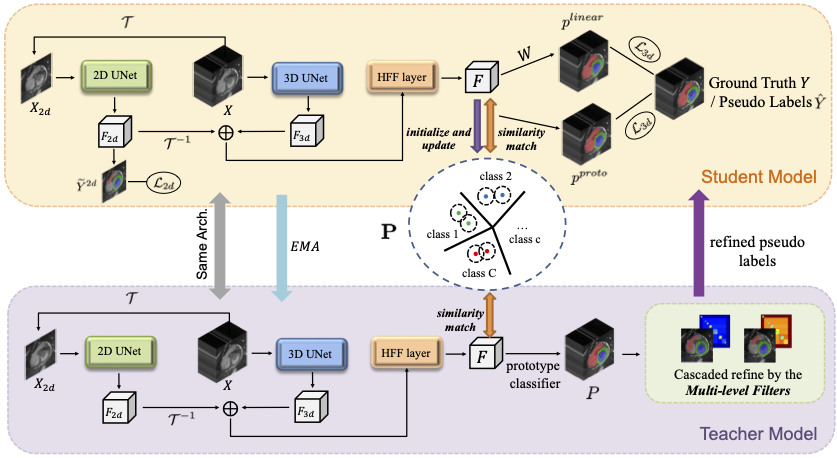

# Semi-supervised Class Imbalanced Deep Learning for Cardiac MRI Segmentation (MICCAI 2023)

This repository contains the source code of the paper Semi-supervised Class Imbalanced Deep Learning for Cardiac MRI Segmentation.
## Prepare
#### Datasets
Our method is evaluated with two datasets: ACDC and MMWHS.
* For the ACDC dataset, please download the original training images from the [official site](https://www.creatis.insa-lyon.fr/Challenge/acdc/databases.html). Place the folder `training` as follows:
```
├── data
│   ├── ACDC
│   │   ├──training
│   │   ├──train.txt
```
* For the MMWHS dataset, please download the original training images from the [official site](http://www.sdspeople.fudan.edu.cn/zhuangxiahai/0/mmwhs/). Only the MRI images are used in this work. Place the folder `mr_train` as follows:
```
├── data
│   ├── MMWHS
│   │   ├──mr_train
│   │   ├──train_c.txt
```
You need to change the name of data paths according to your actual experiments.

#### Environment
In order to install the correct environment, please run the following script:
```
conda create -n ssci python=3.7.13
conda activate ssci
pip install -r requirements.txt
```

#### Building from source
Before the training, you need to first compile the C++ extension of the tree filters implementation.
* `cd code/utils/lib_tree_filter`
* `sudo python3 setup.py build develop`

## Run
#### MMWHS preprocessing
First, do the preprocessing for the MMWHS dataset by runing: 
```
python cardiac_processing.py
```

#### Model training
Then, train the model by using the MMWHS dataset
```
python train_MMWHS.py
```
Train the model by using the ACDC dataset
```
python train_ACDC.py
```
#### Model inference
Test te trained model on the evaluation set, for the MMWHS dataset
```
python test_MMWHS.py
```
For the ACDC dataset
```
python test_ACDC.py
```


## Acknowledgement
The implementations of tree filters and prototype learning are borrowed from `TreeFilter-Torch` and `ProtoSeg`
* TreeFilter-Torch: https://github.com/Megvii-BaseDetection/TreeFilter-Torch
* ProtoSeg: https://github.com/tfzhou/ProtoSeg

Thanks a lot for their splendid work and code sharing!
